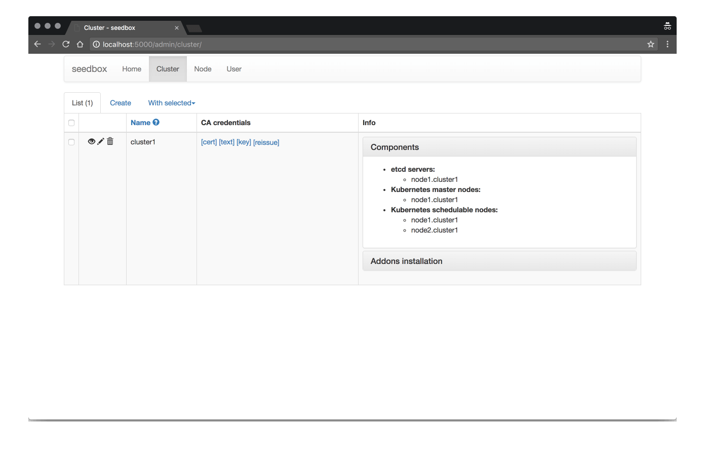

# seedbox

Baremetal CoreOS cluster provisioner with web UI. Currently it's primary goal is to boot CoreOS
clusters using PXE without installation. But it easily can be extended to render kubernetes assets for
different deployments.

## Comparison with other projects

* [CoreOS matchbox](https://github.com/coreos/matchbox). It doesn't provide complete config rendering facility.
  There are examples, but they are hard to read and not modularized.

* [Tectonic installer](https://github.com/coreos/tectonic-installer). This is missing config rendering app
  for matchbox. This project was open-sourced after seedbox was started. It's highly modularized
  and uses HCL (HashiCorp configuration language) to render config files. But it's tied to CoreOS tectonic.
  There is no option to render clean Kubernetes configuration.

Seedbox is all-in-one project compared to those above. You will get web UI, iPXE handler, config renderer, PKI,
cluster state tracking and maybe something more in future versions.

Actually seedbox config template files are based on files rendered by **closed**-source tectonic installer.
They are split into packages by function and rendered using Python Jinja2 template engine.

**Closed**-source Tectonic installer is claimed as installer for production grade clusters. So you can
say this about seedbox as well. 😀 But I'm not sure of that.

## Web UI

## PKI

You will have PKI out of the box. It's simple but powerful enough. It provides one CA per cluster and will
automatically issue certificates for nodes and users. Also it will warn you if there is something
wrong with certificates (expired, changed name, etc).

Credentials are automatically transferred to nodes in most secure manner possible for automatic provision.

## Node state tracking

Nodes notify seedbox after successful boot and upload active ignition config, so seedbox can track
current state of a cluster.
