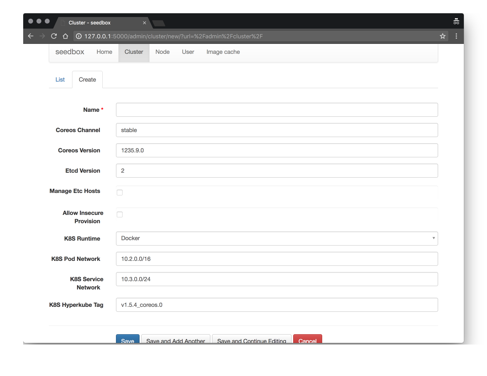
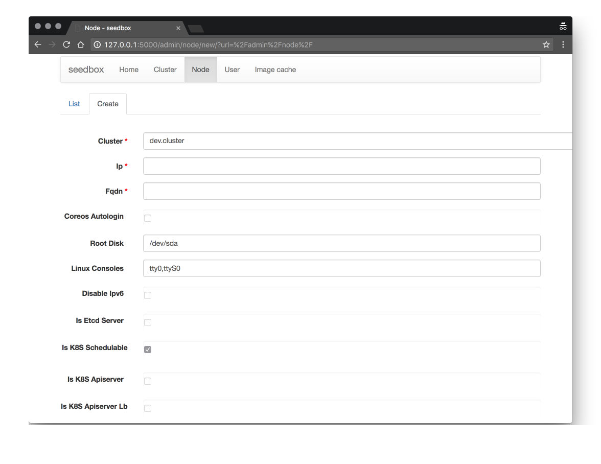
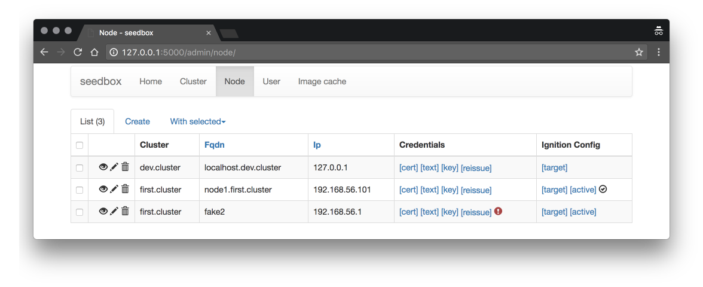

# seedbox

Baremetal CoreOS cluster provisioner with web UI. Currently it's primary goal is to boot CoreOS
clusters using PXE without installation. But it easily can be extended for any provision method.

## What is wrong with CoreOS matchbox

Actually it's based on example ignition config files from [CoreOS matchbox](https://github.com/coreos/matchbox).
But ignition config in seedbox is splet into mutiple files to increase readability. This also
provides the most important feature: you can reuse parts of a configuration in different setups.
When you use seedbox you just set checkboxes for which features you need on a cluster and nodes. And
config renderer will generate ignition config file for you. In sources systemd unit files are grouped together
with any required files to help track dependencies. In matchbox some units described at beginning of an
ignition file require files described at end of the file. This is hard to read and maintain.

While reading matchbox example ignition files you can see many copy-pasted parts. `k8s-controller` and
`k8s-worker` have many of them. With seedbox you will get flexibility to have some nodes to be just etcd servers,
some k8s controllers and workers without maintaining a bunch of long ignition files.

## Web UI

## PKI

You will have PKI out of the box. It's simple but powerful enough. It provides one CA per cluster and will
automatically issue certificates for nodes and users. It also will warn you if there is something
wrong with certificates (expired, changed name, etc).

Credentials are automatically transferred to nodes in most secure manner possible for automatic provision.

## Node state tracking

Nodes notify seedbox after successful boot and upload active ignition config so seedbox can track
current state of a cluster.

## Ignition file compare

If you afraid to launch clusters with new untested software you can use provided `ignition-compare`
script to compare rendered configuration with yours. Copy your ignition config from a server (it is stored
in `/run/ignition.json`). Next start to provision using seedbox. All nodes will report applied ignition
config back to seedbox and you can download it from web UI (or you can copy `/run/ignition.json` by hand
if you like to). Next run `python ignition-compare.py your.json seedbox.json | colordiff | less` and see
any differences.

Seedbox was developed by constantly checking differences with matchbox'es `k8s-controller` and `k8s-worker`
example profiles. And changes are minimal.

## Roadmap

* add k8s apiserver loadbalancers provision
* add [k8s authorization webhook](https://kubernetes.io/docs/admin/authorization/)
* add support for persistent CoreOS installation
* add support for bootkube
